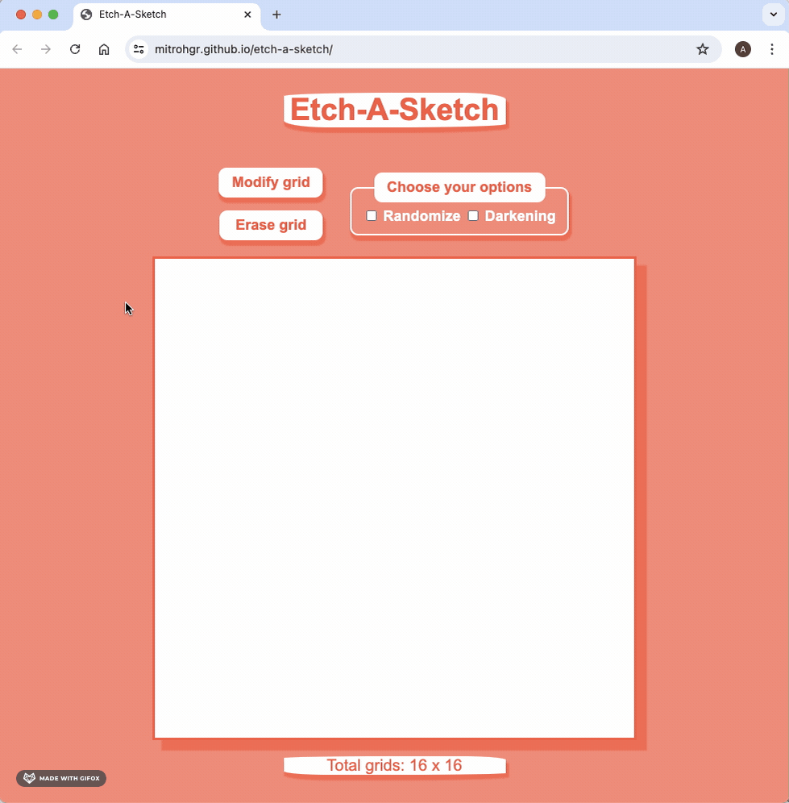
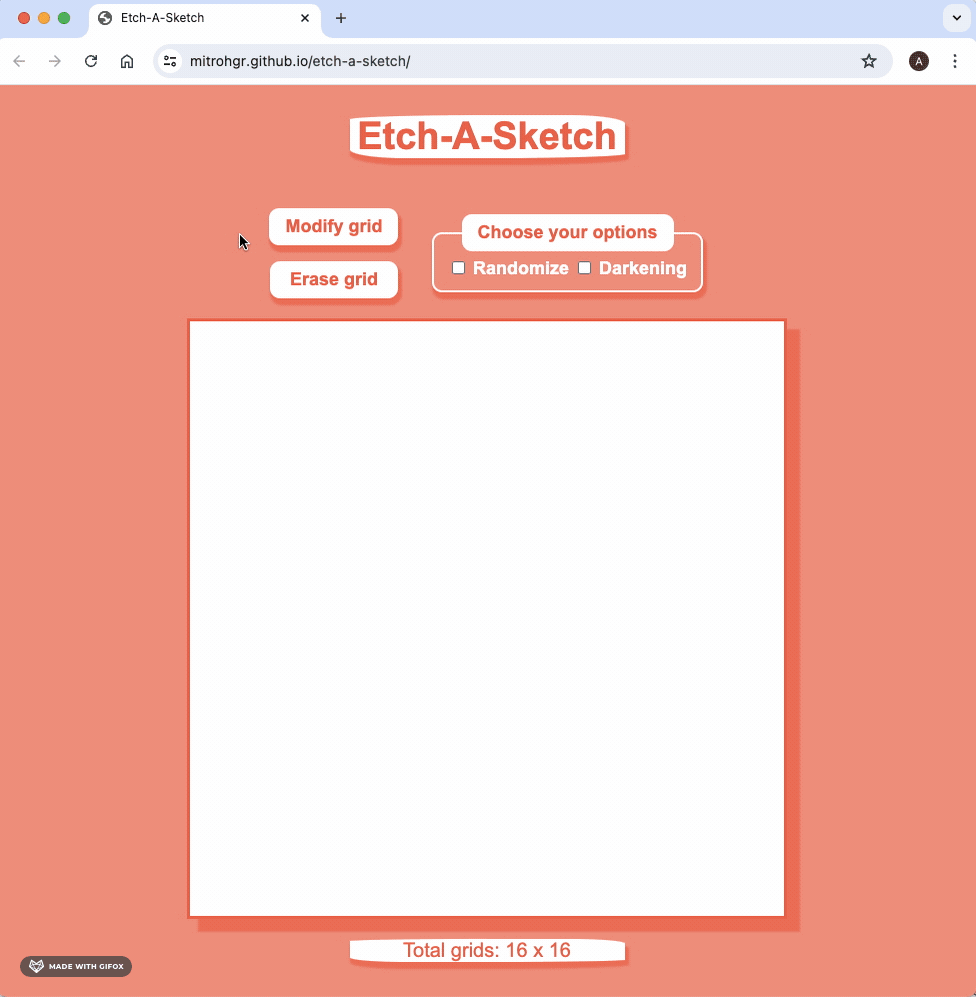
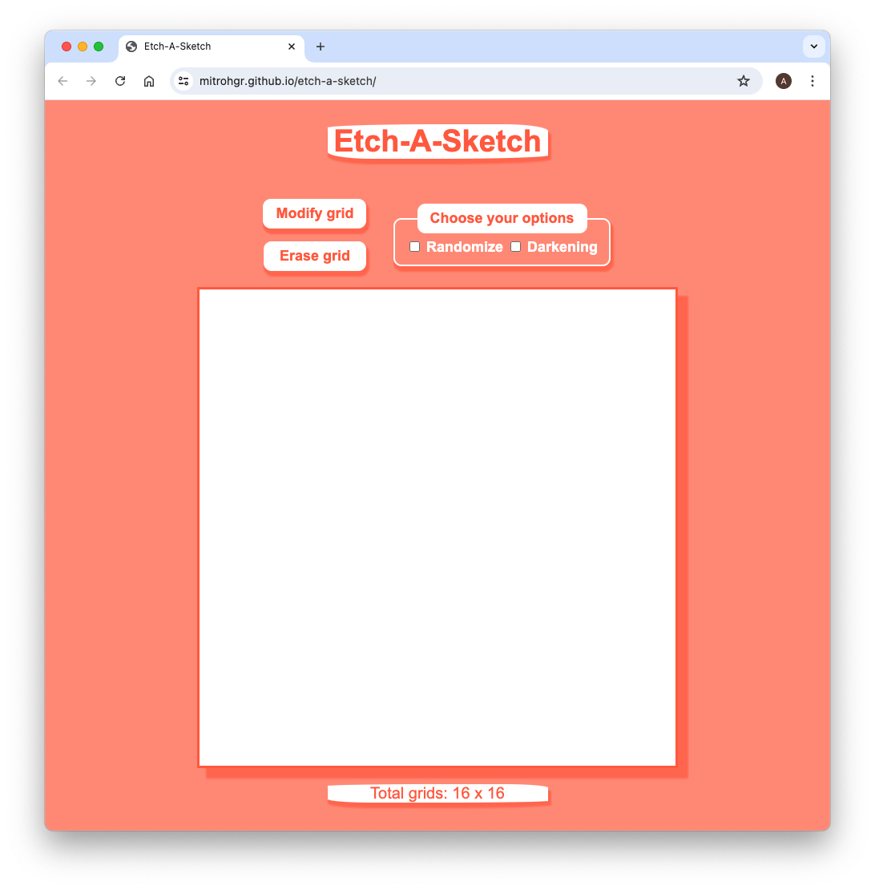
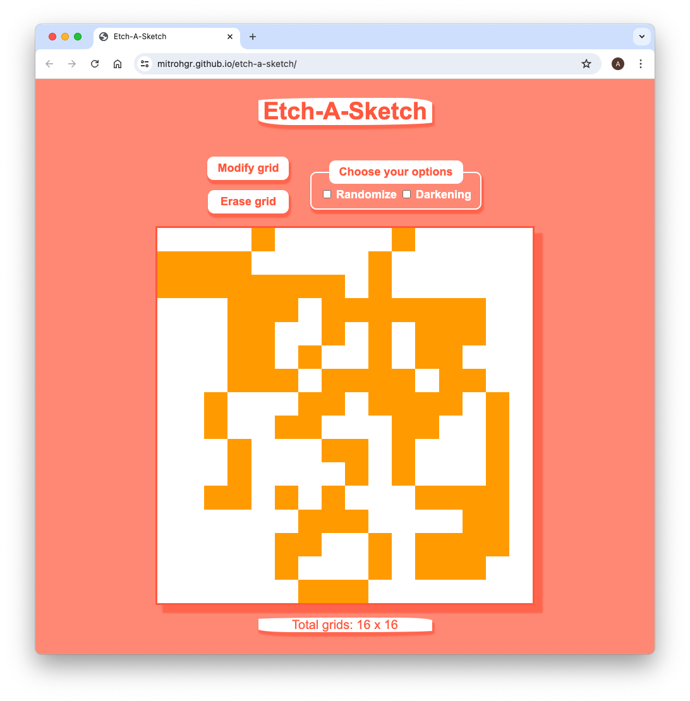
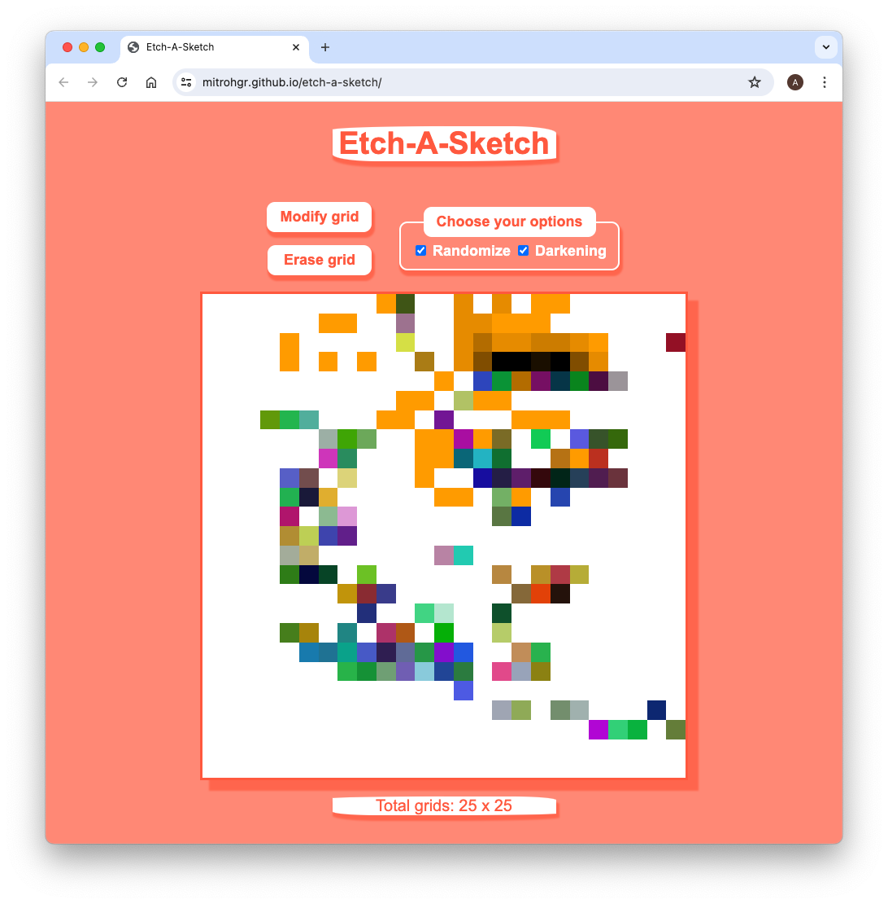

# etch-a-sketch
A Browser Version of Etch-A-Sketch

## Demo

## Status

***This project will no longer be worked upon.***

This is because the [Learning to Code](https://dev.to/theodinproject/learning-code-f56) section of the [Becoming a TOP Success Story](https://dev.to/i3uckwheat/series/16683) makes it clear to [only focus on the point of the assignment](https://dev.to/theodinproject/learning-code-f56) and that [foundations isn't a strong portfolio generator](https://dev.to/theodinproject/learning-code-f56).

## General Info

**etch-a-sketch** is the [fourth project](https://www.theodinproject.com/lessons/foundations-etch-a-sketch) from the [Foundations Course](https://www.theodinproject.com/paths/foundations/courses/foundations) in [The Odin Project](https://www.theodinproject.com/about).

Here, I create a browser version of a pretty neat toy (mainly using DOM manipulation skills) that resembles something  between a sketchpad and an Etch-A-Sketch.

## Screenshots

## Technologies

+ ***CLI***
+ ***Git***
+ ***GitHub***
+ ***HTML***
+ ***GitHub Pages***
+ ***CSS***
+ ***JavaScript***

## Self-reflections

> This project is even better, more fun, and more challenging that the [previous one](https://github.com/mitrohgr/rock-paper-scissors). This was more challenging mainly due to the googling and stackoverflow-ing (and looking up the documentation) needed to understand how to achieve the tasks in the extra credit section, namely, randomizing colors throughout the grid and progressively darkening the grid by 10% upon each interaction. All the other tasks were not that difficult provided the tasks are treated with grit and persistence. For randomizing colors across grid, [looking up the documentation on Math.random() and its functions proved helpful](https://devdocs.io/javascript/global_objects/math/random) and for progressive darkening effect (or is it really darkening?), a bit of commonsense about [how to manipulate background-color's](https://devdocs.io/css/background-color) and [opacity will be helpful](https://devdocs.io/css/opacity).

> [!NOTE]
> I have gotten into the habit of keeping developer tools open throughout the time I'm working on the project. This is quite helpful because I generally [use the rectangle window manager on mac](https://rectangleapp.com/) in order to have google chrome and my text editor side-by-side. In the browser, I change the dock position to bottom and always look for elements, styles, console, and sources pane whenever I'm unable to see either the div's changing color, the div opacity going up (or down), etc. Once more, debugging, developer tools combined with grit is the answer to calmly finish this project.

## Acknowledgements

+ *No credits* for this project.

## Contact and Support

+ Feel free to contact ***mitrohgr_03505*** for project-related queries.
+ No further feature modifications or improvements will be done to this project.
